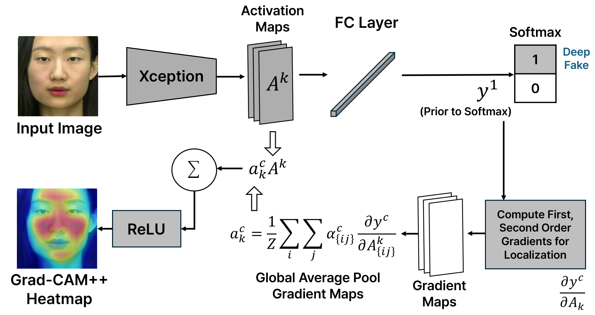
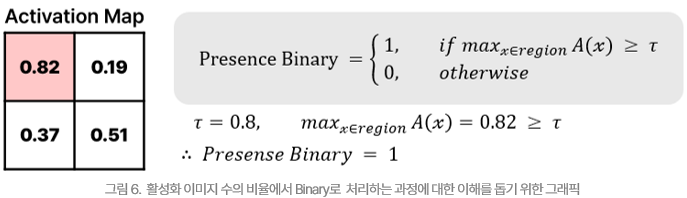
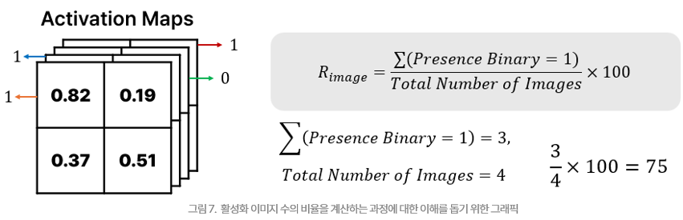
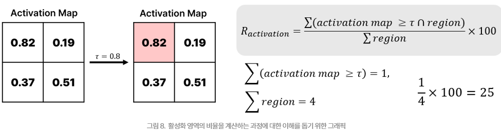
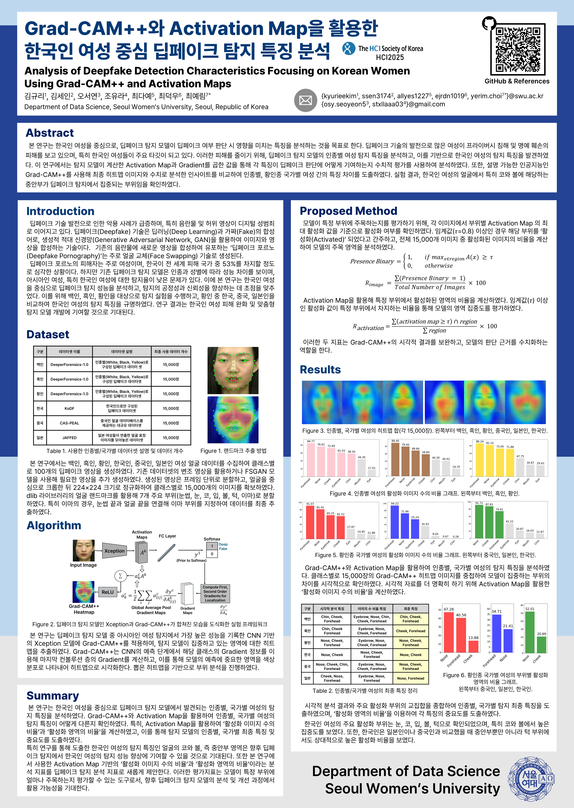

## HCI KOREA 2025 Paper Code
<div align="center">
<h3>Grad-CAM++와 Activation Map을 활용한 한국인 여성 중심 딥페이크 탐지 특징 분석</h3>
<h4>Analysis of Deepfake Detection Characteristics Focusing on Korean Women
Using Grad-CAM++ and Activation Map</h4>

[Kyuri Kim](https://github.com/kyuriya)<sup>1</sup>
, [Sein Kim](https://github.com/seiinkiim)<sup>1</sup>
, [Seoyeon Oh](https://github.com/sohds)<sup>1</sup>
, [Yura Cho](https://github.com/stxllaaa)<sup>1</sup>
, [Daye Choi](https://github.com/Choi-Daye)<sup>1</sup>
, [Dukwoo Choi](https://github.com/ejrdn)<sup>1</sup>
, and [Yerim Choi](https://sites.google.com/view/imlab-swu/yerim-choi?authuser=0) <sup>1&dagger;*</sup>
<br>
<sup>1</sup>Seoul Women's University<br>
<span style="color: gray;">every member has equal contribution</span>
<br>
[[Paper]](https://www.dbpia.co.kr/journal/articleDetail?nodeId=NODE12131642) [[Code]](https://github.com/sohds/deepfake-detection-korean-women)<br>
<br>
<br>
<span style="color: gray;">Experiment Flow</span>
</div>
<br>

## 📝 Abstract
- This study aims to analyse the characteristics that affect the deepfake detection model's ability to determine whether a video is deepfake or not, focusing on Korean women.
- In this study, we used numerical evaluation to analyse how each feature contributes to the deepfake judgement by multiplying the activation map and gradient calculated by the detection model. 
- Compared the final heatmap image with the numerical insights using Grad-CAM++, an explainable artificial intelligence, to derive feature differences between women by race.

<br>

## 📥 Dataset
1. <a href="https://deepbrainai-research.github.io/kodf/">KoDF: A Large-scale Korean DeepFake Detection Dataset </a>
2. <a href="https://liming-jiang.com/projects/DrF1/DrF1.html">DeeperForensics-1.0: A Large-Scale Dataset for Real-World Face Forgery Detection</a>
3. <a href="https://ieeexplore.ieee.org/document/4404053">The CAS-PEAL large-scale Chinese face database and baseline evaluations</a>
4. <a href="https://paperswithcode.com/dataset/jaffe">The Japanese Female Facial Expression (JAFFE) Dataset</a>

<br>

## 📝 Setting
```python
# Clone the repository
git clone https://github.com/sohds/deepfake-detection-korean-women.git

# Install dependencies
pip install -r requirements.txt

# Run the experiment
python experiment.py
```
- All preprocessing steps are included in the code.
- Settings can be configured through the config file.

<br>

## 💡 Research Goal
- There are significant differences in detection accuracy across races and genders in deepfake detection.
  - In particular, detection accuracy is notably lower for Asians and women compared to other groups.
- However, the ratio of deepfake victims between women and men is 99:1, with South Korea being the most affected country accounting for about 57% of victims.
- We aim to examine which facial regions different deepfake detection models focus on when analyzing women across races and East Asian nationalities.

<br>

## 🔍 Evaluation Method
<div align="center">



</div>


<br>

## 📝 Poster
<div align="center">

</div>


<br>

## 📚 References
[1] Collins, B. G., & Zimmer, Z. E. (2019). Deepfakes and digital disinformation: The new weapon in the cyber warfare arsenal. *Journal of Cyber Policy, 4*(3), 378-396.<br>
[2] 경찰청. (2024). 딥페이크 탐지 소프트웨어 개발. [보도자료](https://www.police.go.kr/user/bbs/BD_selectBbs.do?q_bbsCode=1002&q_bbscttSn=20240305110859800)<br>
[3] Security Hero. (2024). [State of Deepfakes](https://www.securityhero.io/state-ofdeepfakes/#key-findings)<br>
[4] 김영희, & 박철수. (2023). 딥페이크 탐지 기술의 현황과 발전 방향. *정보보호학회논문지, 33*(2), 45-60.<br>
[5] Trinh, L., & Liu, Y. (2021). An examination of fairness of AI models for deepfake detection. *arXiv preprint arXiv:2105.00558*.<br>
[6] Xu, Y., Terhöst, P., Pedersen, M., & Raja, K. (2024). Analyzing fairness in deepfake detection with massively annotated databases. *IEEE Transactions on Technology and Society*.<br>
[7] Nadimpalli, A. V., & Rattani, A. (2022). GBDF: gender balanced deepfake dataset towards fair deepfake detection. In *Proceedings of the International Conference on Pattern Recognition* (pp. 320-337). Springer Nature Switzerland.<br> 
[8] 박진수, & 김민수. (2024). 딥페이크 탐지 기술의 최근 동향. *한국정보과학회지, 41*(3), 123-135.<br>
[9] Sun, Z., Han, Y., Hua, Z., Ruan, N., & Jia, W. (2021). Improving the efficiency and robustness of deepfakes detection through precise geometric features. In *Proceedings of the IEEE/CVF Conference on Computer Vision and Pattern Recognition* (pp. 3609-3618).<br>
[10] Jiang, L., Li, R., Wu, W., Qian, C., & Loy, C. C. (2020). Deeperforensics-1.0: A large-scale dataset for real-world face forgery detection. In *Proceedings of the IEEE/CVF Conference on Computer Vision and Pattern Recognition* (pp. 2889-2898).<br>
[11] Gao, W., Cao, B., Shan, S., Chen, X., Zhou, D., Zhang, X., & Zhao, D. (2007). The CAS-PEAL large-scale Chinese face database and baseline evaluations. *IEEE Transactions on Systems, Man, and Cybernetics-Part A: Systems and Humans, 38*(1), 149-161.<br>
[12] Lyons, M., Kamachi, M., & Gyoba, J. (1998). [The Japanese Female Facial Expression (JAFFE) Dataset](https://doi.org/10.5281/zenodo.3451524). Zenodo.<br>
[13] Kwon, P., You, J., Nam, G., Park, S., & Chae, G. (2021). Kodf: A large-scale korean deepfake detection dataset. In *Proceedings of the IEEE/CVF International Conference on Computer Vision* (pp. 10744-10753).<br>
[14] Chattopadhay, A., Sarkar, A., Howlader, P., & Balasubramanian, V. N. (2018). Grad-cam++: Generalized gradient-based visual explanations for deep convolutional networks. In *2018 IEEE Winter Conference on Applications of Computer Vision (WACV)* (pp. 839-847).<br>
